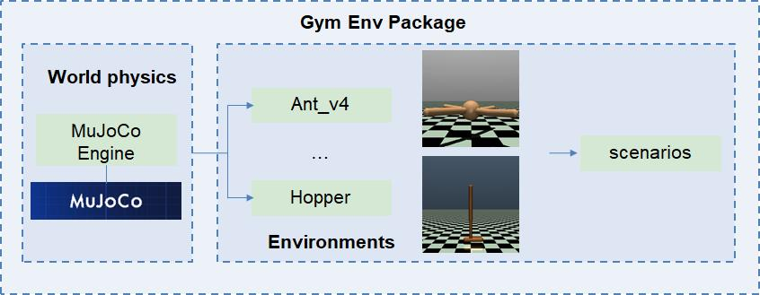
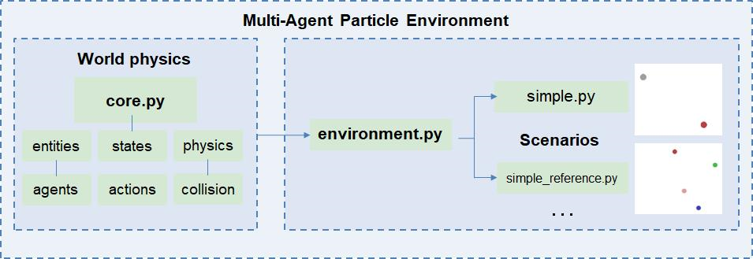
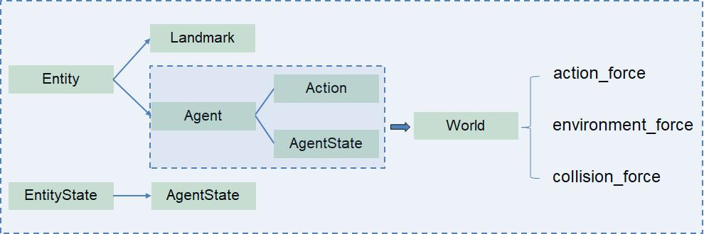
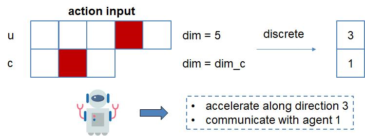

# Introduction to OpenAI Gym

This document serves as an introduction to the implementation logic of reinforcement learning(RL) with Gym. We do not discuss the details of coding such as how action spaces are defined in Gym.

To read the math expressions of this document online, we recommend you to install [Mathjax plugin for github on Chorme](https://chrome.google.com/webstore/detail/mathjax-plugin-for-github/ioemnmodlmafdkllaclgeombjnmnbima) or read in the [preview](/README.md). 

## Installation and Introduction

For installation, I recommend to start a new Anaconda environment, and build the gym environment for your project inside it:

```bash
conda create -n 'CondaEnvName'
conda activate 'CondaEnvName'
pip install gym==0.10.5
```

This command installs core gym APIs with basic gym environments such as [`Atari`](https://www.gymlibrary.dev/environments/atari/). If you want to install gym with additional environments such as [`MuJoCo`](https://www.gymlibrary.dev/environments/mujoco/), use

```bash
pip install gym[mujoco] 
```

Taking the MuJoCo environment as an example, a gym environment usually contains the following contents in logic: 



- ***World physics*** describe the rules based on which the environment works. For example, supported by the [DeepMind MuJoCo engine](https://github.com/deepmind/mujoco), the mujoco enviroment have physics laws such as gravity, collision, joint constraints… In constrast, the atari environment has no gravity but has rules such as how bullets fly.
- ***Environments*** are built based on the world physics and provide an environment for RL. For example, Ant_v4 puts an ant on a plane and users can teach the ant to walk with RL methods inside this environment. Different ***scenarios*** can be set if we hope the ant to learn different skills in this environment.

Next, we' ll talk about how Gym is used in reinforcement learnings.

## RL in Gym environments

In reinforcement learning, the following elements are required:

- ***Agent*** obtain information $o_t$ and chooses certain actions from its policy at each time step: $p(a_t\mid s_t) = \pi (o_t)$
- ***Environment*** is influenced by the agents' actions and changes its states based on physics laws: $s_{t+1} \sim \mathcal{P} (s_{t+1} \mid s_t,a_t)$
- ***Reward*** is fed to the agents from the environment to enable them learn from their experiences: $r_t = f_r (s_t,a_t)$

The role of gym environment in RL is right as its name 'environment'  — get action $a_t$ from agents, step to another state $s_{t+1}$ basaed on world rules, and feedback rewards $r_t$ — illustrated as the picture below:


And following is a commonly seen call to the gym enviornment APIs in RL training process (*multi-agent centralized* *training* as an example):

```python
import gym
env = gym.make('CollectiveManipulation_Env-v0')

import Agents
agents = Agents.init(num = 50)

episodes = 10000
for episode in range(episodes):
	accumulated_reward = 0
	env.reset()
	for time in range(300):
		actions = []
		obs = env.get_obs()
		for i in range(agents):
			action = agents[i].select_action(obs[i])
			actions.append(action)
		state, reward = env.step(actions)
		env.render()
		accumulated_reward += reward
	agents.policy_update(reward)
env.close()
```

The below lines show core functions of a gym environment and how gym environments work in RL: 

```python
# start an environment
env = gym.make('CollectiveManipulation_Env-v0')
# initialze the environment before episode starts
env.reset()
# get observation from its current state
obs = env.get_obs()
# step to another state based on its rules, and return a reward
state, reward = env.step(actions)
# render the GUI if possible
env.render()
# close the environment
env.close()
```

And these functions are important for us to build our own environments.

## Build a Gym environment

> Notice: This document is written to describe logic. for a detailed descripiton, please refer to the official [gym documents](https://www.gymlibrary.dev/content/environment_creation/).
> 

A Gym environment is a Python class which holds the above core functions, and it is usually defined similar to the following form:

```python
import gym

class CollectiveManipulationEnv(gym.Env):
	def __init__(self,world, actors, init_state):
		self.world = world
		self.actors = actors
		self.state = init_state
	
	def get_obs(self):
		return obs
	
	def step(self, actions):
		self.state = rules(actors, actions, world)
		reward = self._get_reward(self.state)
		return state, reward

	def render(self):
		# render environment
	
	def reset(self):
		self.state = init_state

	def _get_reward(self, state):
		return reward
```

Only defining a class will not enable us call the Gym APIs, it must be *registered* and *wrapped into a Python package* according to corrent file structures. View the [document](https://www.gymlibrary.dev/content/environment_creation/) for details. And finally, the package needs to be installed into your Anaconda environment:

```bash
cd PackageFolder
pip install -e PackageName
```

# Multi Agent Partical Environment

> This is a simple environment but with relative **comprehensive physics world properties** such as communication, collision, force and so on. We can use it to run our RL with some modification. It is **light-weight** compared to other environments, and its good for our large-scale settings.

## Introduction

This Gym environment package is structured as the following picture.

- `core.py` In 'core.py', the basic properties of world and entities (agents and obstacles) are defined, also their states, actions, and physics interaction laws.
- `environment.py` Based on 'core.py', the basic functions such as `step()`, `render()`, and `reset()` are defined. The action space and observation space are also fixed here in `__init__()`.
- ***scenarios***: different scenarios have different agents and rewards. They are coded for different tasks. For example, in `simple.py` there is only one agent, one goal and no communication. In `simple_reference.py` there are multiple agents and communication between them.



To run this environment, a sample code is as follows:

```python
import multiagent
from make_env import make_env

def main(scenario_name):
    env = make_env(scenario_name)
    env.reset()
    for i in range(300):
        env.step([[0,1,1,1,1]]) # notice the action space
        env.render()
    env.close()

main('simple')
```

We need to use `make_env()` function and input the file name of the desired scenario. The rest parts are the same as other gym environments. Notice that this environment only has 1 channel (5 dimension) for physical action input and 1 channel for communication action input. (See the `_set_action()` in [environment.py](http://environment.py)). So we need to modify its `core.py` and `environment.py`. Then design our own scenarios for large-scale collective manipulation.

For more comprehensive understanding, read `core.py`, `environment.py`, and `simple_environment.py` to figure out how worlds are set, actions are delivered into the world, and how the worlds are updated.

## World Physics

> Describe the entity states(properties), interaction rules and action inputs to the current particle environment.

In `core.py`, the relationships between classes (green) are illustrated in the picture below. `Entity` is the parent class of `Landmark` and `Agent`, which contains `action` and `AgentState`. The `World` class contains all possible entities, and describes how forces are added to propel their motions.



### Entities and States

- ***Entities*** have properties such as color, mass, max speed and a constant acceleration. Users can also define if the entity is movable or collision enabled.
- ***Agents*** have other properties like if communication allowed, noise, and control input range.
- ***AgentState*** includes its position, velocity and current communication signal to exchange information with other agnets.

### Interaction Rules (Dynamics)

In `World` class, how forces are applied are described. For an agent $i$, its dynamics is governed by

$$\begin{equation}\begin{aligned} & m_i \frac{d\boldsymbol{v}^i}{dt}={\boldsymbol{u}}_i + \sum_{j\in \mathcal{R}(i)} A \log\left[1+\exp(-\frac{r_{ij}-d_m}{B})\right]\cdot {\boldsymbol{p}}_{ij} \\ & |\boldsymbol{v}^i|<v_{\text{max}} \end{aligned}\end{equation}$$

which is similar to the social force model where a repulsion force is generated between entities if the distance is smaller than the minimum allowed distance.

### Action Input

In `environment.py`, the agents' action space is divided into the force space `u_action_space` and communication space `c_action_space`. The action input is either discrete numbers (0,1…N) or an one-hot N dimensional vector, depending on boolean `discrete_action_input`. And the input are mapped to accleration on different discrete dirctions and communication with different agents. And the acceleration generates the motion of agents further. For more details, refer to `_set_action()`.



## Modification

> For the simulation setup of different multi-agent researches, the environment should be modified.

To modify this environment, one should first figure out his/her own RL model, i.e. a Markovian decision process $\mathcal{M}=<\mathcal{S},\mathcal{A},\mathcal{O},\mathcal{R},\mathcal{P}>$, where the state transition probability matrix $\mathcal{P}$ is decided by the world dynamics. Then based on your RL model, change `core.py` and `environment.py` respectively.

Take the world dynamics of RL in our research as an example.

### Our Physics

In our research, agents have different communication abilities $r$. And the *agent state* is defined as a set $\boldsymbol{q}^j = <\boldsymbol{H},\boldsymbol{h},\boldsymbol{v},\boldsymbol{p},\boldsymbol{\pi},T>^j$, where $\boldsymbol{\pi}$ is an one-hot vector denoting its semantic position. In our world, we don't have a concept of acceleration. Instead, the motion of agents is governed by the *social force model*:

$$\begin{equation} m_i \frac{d\boldsymbol{v}^i}{dt} = m_i \frac{\boldsymbol{h}^i - \boldsymbol{v}^i}{\tau} + \sum_{j\in \mathcal{R}(i)} f_{ij} + f_{ik}\end{equation}$$

where $f$ denotes the repulsive forces between entities. We can directly utilize `get_collision_force()` from `core.py`, and change its action force input into our motion intention.

Hence, we need to modify the *properties* of classes and *force functions* in `core.py`.

The action of each agent is also different. For dynamic election, the action space is defined as an discrete space $\mathcal{A} = T \times \mathcal{A}_{\kappa}$. Therefore, we also need to modify the action input space in `environment.py`.

### Core.py

- ***Agent***: As for the properties of agents, we need to add communication ability, that is, the communication range $r$.
- ***AgentState***: For our state $\boldsymbol{q}$, besides EntityStates, our agents have status $T$, semantic intention $\boldsymbol{H}$,motion intention $\boldsymbol{h}$, and a semantic vector $\boldsymbol{\pi}$ which depends on the division of the space.
- ***Action***: From `apply_action_force()` we know that `u` in Action is a 2D physics force added by the agent itself.

### Environment.py

### New Scenario

> We need to define our rewards and observations for RL in new scenraio. And we also need to define how agents communicate with each other inside.